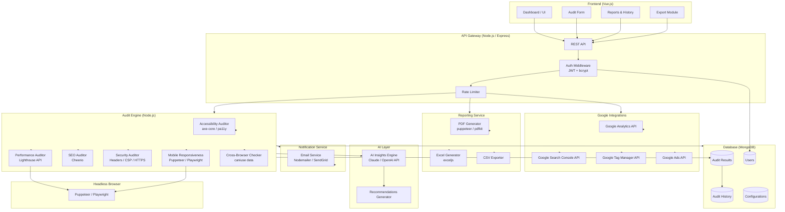

# WebAuditor

A comprehensive web auditing tool that helps analyze web pages for accessibility, performance, SEO, security, and more — with AI-powered insights and automated reporting.

## Architecture

## Tech Stack

| Layer | Technology |
|-------|-----------|
| Frontend | Vue.js |
| Backend | Node.js + Express |
| Database | MongoDB |
| Headless Browser | Puppeteer / Playwright |
| Accessibility | axe-core / pa11y |
| Performance | Lighthouse API |
| HTML Parsing | Cheerio |
| AI Insights | Claude / OpenAI API |
| Email | Nodemailer / SendGrid |
| PDF Export | puppeteer / pdfkit |
| Excel Export | exceljs |

## Features

1. Accessibility audit
2. Performance audit
3. SEO audit
4. Security audit
5. Mobile responsiveness audit
6. Cross-browser compatibility audit
7. AI-powered insights and recommendations
8. Automated reporting
9. User management
10. Audit history
11. Export to PDF, Excel, CSV
12. Email notifications
13. API for integration with other tools
14. Google Analytics integration
15. Google Search Console integration
16. Google Tag Manager integration
17. Google Ads integration
